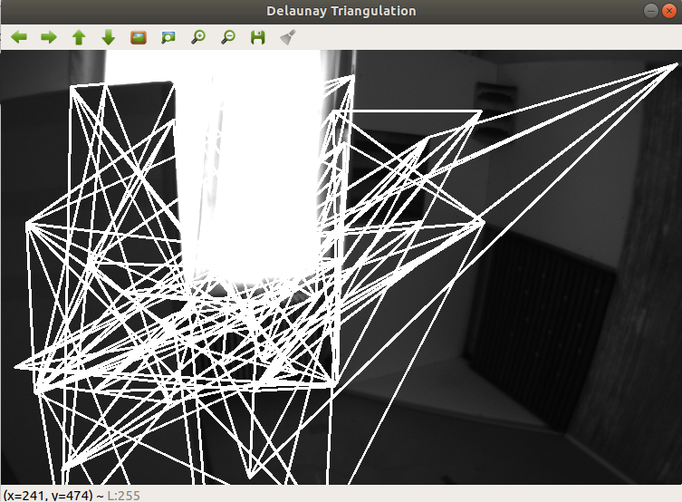

# 2D Delaunay Triangulation

## [Goal] We can generate 2D Delaunary Triangulation method from the FLaME code and J. R. Shewchuk Paper !

Generate 2D Delaunay Triangulation and Visualization

- EuRoC Dataset Example
  
  

---
Reference Paper
  - [Paper 1] Triangle: Engineering a 2D Quality Mesh Generator and Delaunay Triangulator
  - [Paper 2] FLaME: Fast Lightweight Mesh Estimation using Variational Smoothing on Delaunay Graphs

