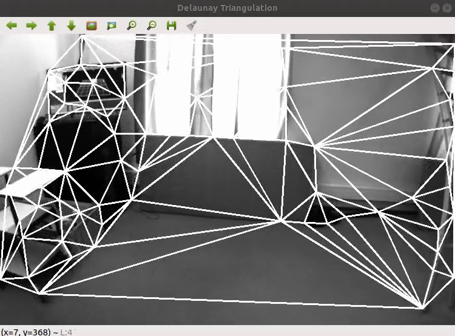

# 2D Delaunay Triangulation and Delaunay Refinement

## [Goal] We can generate 2D Delaunary Triangulation method from the Bowyer-Watson code and Ruppert Paper !

Generate 2D Delaunay Triangulation and Visualization

- EuRoC Dataset Example (Vecon Room)
  
  

- VIODE Dataset Example
  
  <table>
      <tr>
         <td> None </td>
         <td> High Dynamic </td>
      </tr> 
      <tr>
         <td> </td>
         <td> </td>
      </tr>
   </table>

---
Reference Paper
  - [Paper 1] Triangle: Engineering a 2D Quality Mesh Generator and Delaunay Triangulator
  - [Paper 2] FLaME: Fast Lightweight Mesh Estimation using Variational Smoothing on Delaunay Graphs
  - [Paper 3] Computing Dirichlet tessellations
  - [Paper 4] Computing the n-dimensional Delaunay tessellation with application to Voronoi polytopes

